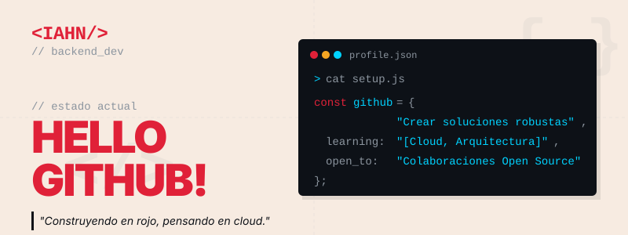
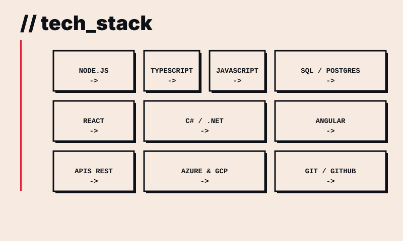
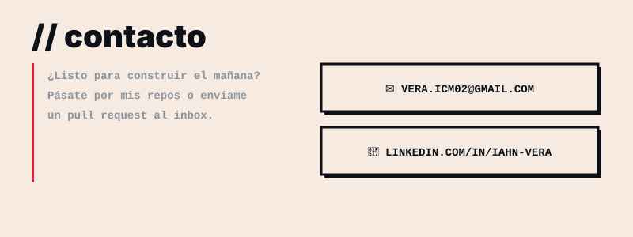

<!-- HEADER: Hero section que marca el branding e incluye un 'setup' de terminal con los objetivos y el enfoque cloud -->

<h3 align="center">
  Backend sólido, mentalidad cloud, código que escala.
</h3>

  <em>Desarrollador enfocado en Backend construyendo arquitecturas robustas, eficientes y escalables.</em>

  
  
  
  

---

 

### 👨‍💻 Sobre mí

Me apasiona desarrollar sistemas eficientes y resolver problemas complejos mediante la escritura de código limpio y mantenible. Mi objetivo es aportar valor construyendo plataformas que no solo funcionen, sino que estén preparadas para el futuro y puedan escalar.

- 🏗️ Especializado en **Desarrollo Full Stack** y **Backend**.
- ☁️ Mentalidad enfocada en **entornos Cloud** y arquitecturas escalables.
- 🎨 Combino el pensamiento lógico del backend con un gusto por el detalle estético, visible en mi <a href="https://portafolio-nine-alpha-44.vercel.app/" target="_blank">Portafolio</a>.
- 🤝 En constante aprendizaje, buscando siempre colaborar y aportar soluciones de valor para el negocio y los usuarios.
- 🟢 **Disponibilidad inmediata** para nuevas oportunidades.

 

### 🛠️ Tecnologías y Herramientas

<!-- TECH STACK: Un bento box compacto similar a tu portfolio para dar una lectura rápida de las tecnologías que manejas a otros devs. -->

_(Un vistazo rápido a mis herramientas principales. Me adapto rápidamente a nuevos lenguajes y frameworks según las necesidades del proyecto)._

 

### 🚀 Proyectos Destacados

> **💡 Nota:** _Aquí puedes visitar algunos de mis desarrollos recientes._

| Proyecto | Descripción | Stack |
| --- | --- | --- |
| **<a href="https://portafolio-nine-alpha-44.vercel.app/" target="_blank">Portafolio Interactivo</a>** | Portafolio personal combinando diseño asimétrico tipo manga y animaciones scroll con un layout Bento Box interactivo. | React, Frontend UI/UX |
| **<a href="https://proyectos-portafolio.vercel.app/" target="_blank">Hub de Proyectos</a>** | Sitio agregador donde despliego mockups, demos y prototipos de mis proyectos en un solo lugar. | Vercel, Frontend |
| **Dashboard Analítico Automático** — <a href="https://proyectos-portafolio.vercel.app/Dashboard%20Anal%C3%ADtico%20Autom%C3%A1tico/mockup_app_script/index.html" target="_blank">Apps Script</a> · <a href="https://proyectos-portafolio.vercel.app/Dashboard%20Anal%C3%ADtico%20Autom%C3%A1tico/mockup_analisis_cualitativo/index.html" target="_blank">Análisis Cualitativo</a> · <a href="https://proyectos-portafolio.vercel.app/Dashboard%20Anal%C3%ADtico%20Autom%C3%A1tico/mockup_analisis_datos_python/index.html" target="_blank">Análisis Python</a> | Automatización de procesamiento de encuestas complejas y datos demográficos (Censo 2024) conectado en tiempo real a Looker Studio. | Google Apps Script, Python, Data Viz |
| **<a href="https://github.com/Iahn02/React-Desafio-Pizzeria" target="_blank">React Desafío Pizzería</a>** | Aplicación e-commerce de pizzería con carrito, gestión de productos y flujo de checkout. | React, JavaScript |
| **<a href="https://github.com/Iahn02/TodaLaPlata2" target="_blank">Toda La Plata</a>** | Plataforma full stack con módulos de gestión y vistas dinámicas. | JavaScript, Full Stack |

 

### 📈 Actividad en GitHub (Telemetría en Vivo)

  

    
    
  

  
<em>(Datos en tiempo real recopilados directamente de mi actividad y repositorios)</em>

 

<!-- FOOTER: Llamado a la acción (Call to action) pensado para reclutadores que visiten el perfil -->

  

